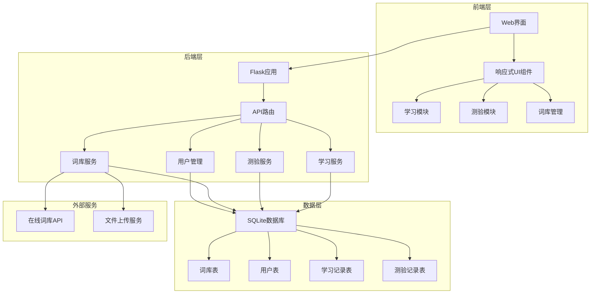
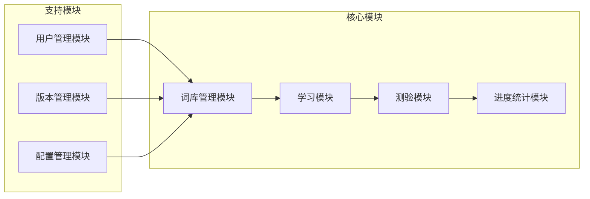
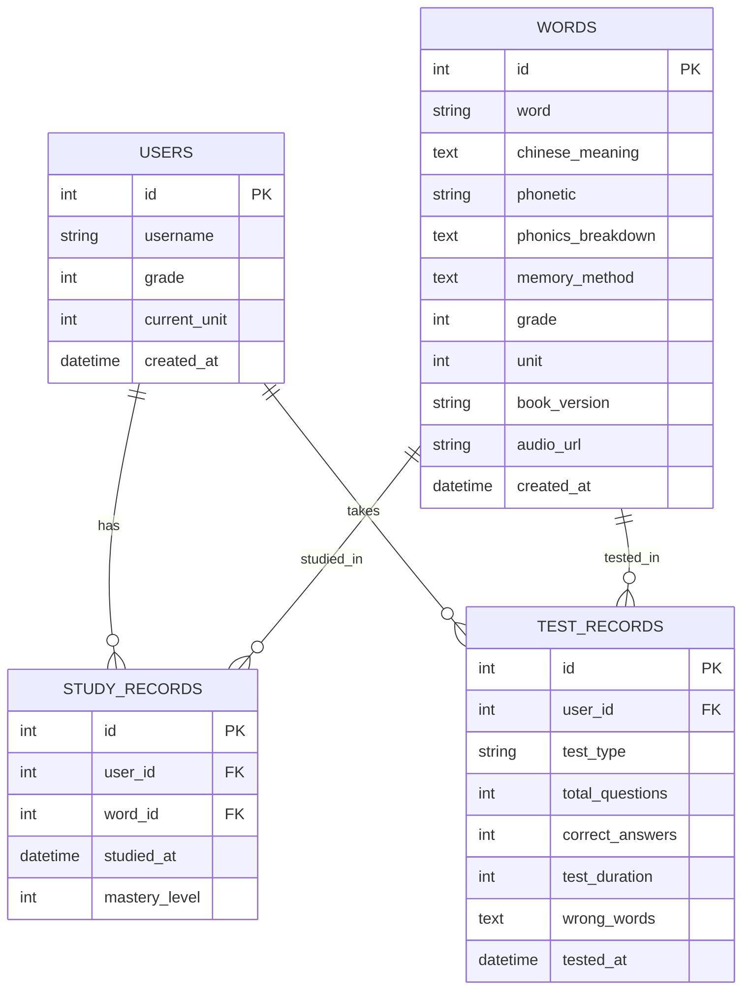
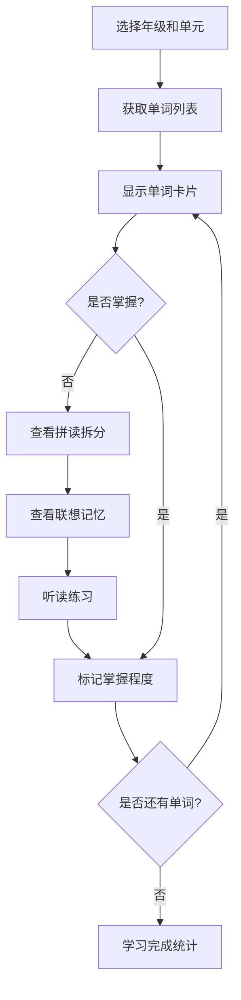
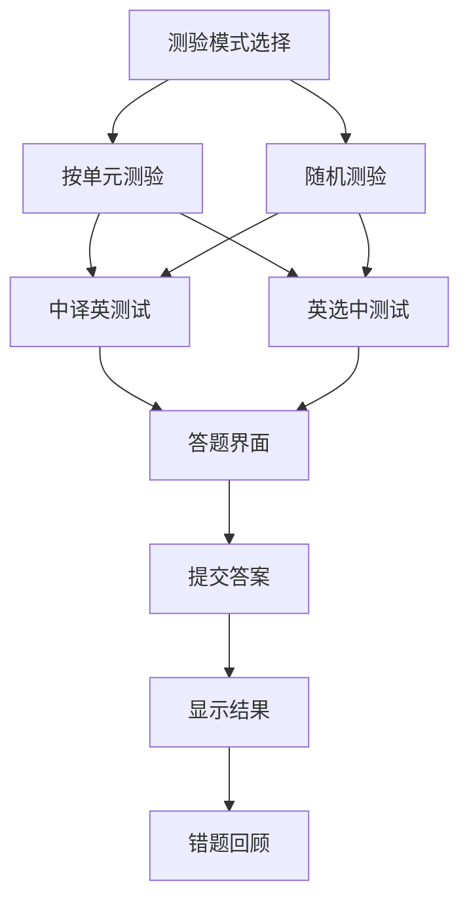
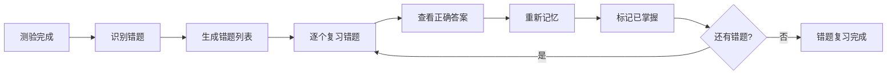
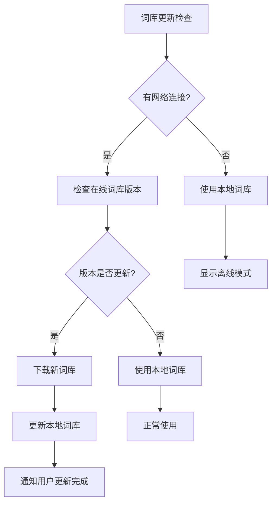
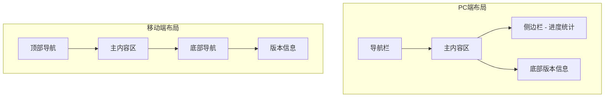
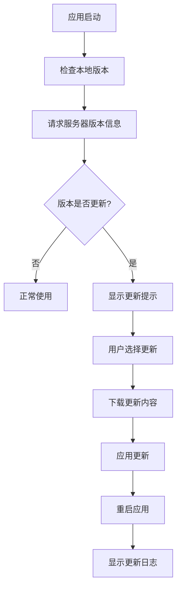

# 小学英语单词复习背诵应用设计文档

## 1. 概述

### 1.1 项目目标
开发一个适合小学生3-6年级的人教版PEP教材英语单词复习背诵应用，提供系统化的单词学习和测验功能，帮助学生有效记忆和掌握英语词汇。

### 1.2 目标用户
- 主要用户：小学3-6年级学生
- 辅助用户：教师和家长

### 1.3 核心功能
- 单词复习背诵（含自然拼读和趣味联想记忆法）
- 单词测验系统（多种测试模式）
- 词库管理（网络获取和手动更新）
- 学习进度跟踪

### 1.4 技术栈
- 后端：Python (Flask/Django)
- 前端：HTML5 + CSS3 + JavaScript
- 数据库：SQLite/PostgreSQL
- 部署：Web服务器

## 2. 架构设计

### 2.1 系统架构图



### 2.2 模块架构



## 3. 数据模型设计

### 3.1 数据库表结构

#### 词库表 (words)
| 字段名 | 类型 | 说明 |
|--------|------|------|
| id | INTEGER | 主键 |
| word | VARCHAR(100) | 英文单词 |
| chinese_meaning | TEXT | 中文含义 |
| phonetic | VARCHAR(200) | 音标 |
| phonics_breakdown | TEXT | 自然拼读拆分 |
| memory_method | TEXT | 趣味联想记忆法 |
| grade | INTEGER | 年级(3-6) |
| unit | INTEGER | 单元号 |
| book_version | VARCHAR(50) | 教材版本 |
| audio_url | VARCHAR(500) | 音频文件URL |
| created_at | DATETIME | 创建时间 |
| updated_at | DATETIME | 更新时间 |

#### 用户表 (users)
| 字段名 | 类型 | 说明 |
|--------|------|------|
| id | INTEGER | 主键 |
| username | VARCHAR(50) | 用户名 |
| grade | INTEGER | 年级 |
| current_unit | INTEGER | 当前学习单元 |
| created_at | DATETIME | 创建时间 |

#### 学习记录表 (study_records)
| 字段名 | 类型 | 说明 |
|--------|------|------|
| id | INTEGER | 主键 |
| user_id | INTEGER | 用户ID |
| word_id | INTEGER | 单词ID |
| studied_at | DATETIME | 学习时间 |
| mastery_level | INTEGER | 掌握程度(1-5) |

#### 测验记录表 (test_records)
| 字段名 | 类型 | 说明 |
|--------|------|------|
| id | INTEGER | 主键 |
| user_id | INTEGER | 用户ID |
| test_type | VARCHAR(20) | 测试类型 |
| total_questions | INTEGER | 总题数 |
| correct_answers | INTEGER | 正确答案数 |
| test_duration | INTEGER | 测试时长(秒) |
| wrong_words | TEXT | 错题单词IDs |
| tested_at | DATETIME | 测试时间 |

### 3.2 数据关系图



## 4. API接口设计

### 4.1 词库管理接口

#### 获取词库列表
```
GET /api/words?grade={grade}&unit={unit}
```

#### 更新词库
```
POST /api/words/update
Content-Type: application/json
{
    "source": "online|manual",
    "data": [词库数据]
}
```

#### 获取单词详情
```
GET /api/words/{word_id}
```

### 4.2 学习模块接口

#### 开始学习会话
```
POST /api/study/start
{
    "user_id": 1,
    "grade": 4,
    "unit": 3
}
```

#### 记录学习进度
```
POST /api/study/progress
{
    "user_id": 1,
    "word_id": 123,
    "mastery_level": 4
}
```

### 4.3 测验模块接口

#### 生成测验
```
POST /api/test/generate
{
    "user_id": 1,
    "test_type": "cn_to_en|en_to_cn",
    "grade": 4,
    "unit": 3,
    "question_count": 10
}
```

#### 提交测验答案
```
POST /api/test/submit
{
    "test_id": "uuid",
    "answers": [
        {"question_id": 1, "answer": "apple"},
        {"question_id": 2, "answer": "banana"}
    ]
}
```

#### 获取测验结果
```
GET /api/test/result/{test_id}
```

## 5. 核心功能模块设计

### 5.1 复习背诵模块

#### 5.1.1 学习流程设计



#### 5.1.2 记忆方法展示
- **自然拼读拆分**：将单词按照发音规律进行分解
- **趣味联想记忆**：通过故事、图像等方式帮助记忆

#### 5.1.3 学习界面组件
```
单词卡片组件:
├── 单词显示区
├── 音标和发音
├── 中文含义
├── 拼读拆分展示
├── 联想记忆展示
├── 音频播放控件
└── 掌握程度评分
```

### 5.2 测验模块

#### 5.2.1 测验类型设计



#### 5.2.2 测验流程设计

1. **测验配置**
   - 选择测验类型（中译英/英选中）
   - 选择测验范围（指定单元/随机）
   - 设置题目数量

2. **答题过程**
   - 逐题显示，计时答题
   - 支持跳过和修改答案
   - 自动保存答题进度

3. **结果展示**
   - 正确率统计
   - 用时统计
   - 错题列表
   - 知识点分析

#### 5.2.3 错题回顾功能



### 5.3 词库管理模块

#### 5.3.1 词库更新策略



#### 5.3.2 手动词库管理
- 支持Excel/CSV文件导入
- 词库数据校验和清洗
- 重复词汇检测和合并
- 词库备份和恢复

## 6. 用户界面设计

### 6.1 响应式设计规范

#### 6.1.1 断点设计
- 移动端：< 768px
- 平板端：768px - 1024px  
- PC端：> 1024px

#### 6.1.2 布局适配



### 6.2 主要页面设计

#### 6.2.1 首页布局
```
首页组件结构:
├── 顶部导航
│   ├── Logo
│   ├── 用户信息
│   └── 设置按钮
├── 主功能区
│   ├── 开始学习卡片
│   ├── 进行测验卡片
│   ├── 学习进度卡片
│   └── 词库管理卡片
├── 学习统计区
│   ├── 今日学习统计
│   ├── 本周进度图表
│   └── 掌握词汇总数
└── 底部版本信息
    ├── 版本号显示
    └── 更新时间
```

#### 6.2.2 学习页面
```
学习页面组件:
├── 进度条
├── 单词展示区
│   ├── 英文单词
│   ├── 音标
│   ├── 中文含义
│   ├── 拼读拆分（可展开）
│   └── 联想记忆（可展开）
├── 操作区
│   ├── 播放发音按钮
│   ├── 掌握程度评分
│   ├── 上一个/下一个
│   └── 返回按钮
└── 学习统计
```

#### 6.2.3 测验页面
```
测验页面组件:
├── 测验信息栏
│   ├── 题目进度
│   ├── 计时器
│   └── 得分显示
├── 题目展示区
│   ├── 题目内容
│   ├── 选项/输入框
│   └── 题目提示
├── 操作区
│   ├── 上一题/下一题
│   ├── 跳过按钮
│   └── 提交答案
└── 答题卡（显示答题状态）
```

### 6.3 视觉设计规范

#### 6.3.1 色彩规范
- 主色调：温和的蓝色系 (#4A90E2)
- 辅助色：橙色 (#F5A623) - 用于提示和按钮
- 成功色：绿色 (#7ED321) - 正确答案
- 警告色：红色 (#D0021B) - 错误提示
- 背景色：浅灰色 (#F8F9FA)

#### 6.3.2 字体规范
- 中文：思源黑体/苹方
- 英文：Roboto/San Francisco
- 字号：12px-24px渐进式设计

#### 6.3.3 间距规范
- 基础间距单位：8px
- 组件间距：16px、24px、32px
- 页面边距：16px（移动端）、24px（PC端）

## 7. 技术实现架构

### 7.1 后端架构设计

#### 7.1.1 Flask应用结构
```
项目结构:
app/
├── __init__.py              # Flask应用初始化
├── models/                  # 数据模型
│   ├── __init__.py
│   ├── word.py             # 单词模型
│   ├── user.py             # 用户模型
│   ├── study_record.py     # 学习记录模型
│   └── test_record.py      # 测验记录模型
├── routes/                  # 路由控制器
│   ├── __init__.py
│   ├── api/                # API路由
│   │   ├── words.py        # 词库API
│   │   ├── study.py        # 学习API
│   │   ├── test.py         # 测验API
│   │   └── user.py         # 用户API
│   └── views/              # 页面路由
│       ├── index.py        # 首页
│       ├── study.py        # 学习页面
│       └── test.py         # 测验页面
├── services/               # 业务逻辑层
│   ├── __init__.py
│   ├── word_service.py     # 词库服务
│   ├── study_service.py    # 学习服务
│   ├── test_service.py     # 测验服务
│   └── data_import.py      # 数据导入服务
├── utils/                  # 工具函数
│   ├── __init__.py
│   ├── validators.py       # 数据验证
│   ├── helpers.py          # 辅助函数
│   └── constants.py        # 常量定义
├── static/                 # 静态资源
│   ├── css/
│   ├── js/
│   ├── images/
│   └── audio/
├── templates/              # HTML模板
│   ├── base.html           # 基础模板
│   ├── index.html          # 首页模板
│   ├── study.html          # 学习页面模板
│   └── test.html           # 测验页面模板
└── config.py               # 配置文件
```

#### 7.1.2 数据库设计和ORM映射

使用SQLAlchemy进行ORM映射，支持SQLite和PostgreSQL：

```python
# 单词模型示例
class Word(db.Model):
    id = db.Column(db.Integer, primary_key=True)
    word = db.Column(db.String(100), nullable=False)
    chinese_meaning = db.Column(db.Text, nullable=False)
    phonetic = db.Column(db.String(200))
    phonics_breakdown = db.Column(db.Text)
    memory_method = db.Column(db.Text)
    grade = db.Column(db.Integer, nullable=False)
    unit = db.Column(db.Integer, nullable=False)
    book_version = db.Column(db.String(50), default='PEP')
    audio_url = db.Column(db.String(500))
    created_at = db.Column(db.DateTime, default=datetime.utcnow)
    updated_at = db.Column(db.DateTime, default=datetime.utcnow)
```

### 7.2 前端架构设计

#### 7.2.1 JavaScript模块组织
```
static/js/
├── main.js                 # 主入口文件
├── modules/
│   ├── word-card.js        # 单词卡片组件
│   ├── test-engine.js      # 测验引擎
│   ├── progress-tracker.js # 进度跟踪
│   └── audio-player.js     # 音频播放器
├── services/
│   ├── api-client.js       # API客户端
│   ├── storage.js          # 本地存储
│   └── cache.js            # 缓存管理
└── utils/
    ├── helpers.js          # 工具函数
    └── validators.js       # 前端验证
```

#### 7.2.2 CSS架构设计
```
static/css/
├── main.css                # 主样式文件
├── base/
│   ├── reset.css           # 样式重置
│   ├── typography.css      # 字体样式
│   └── variables.css       # CSS变量
├── components/
│   ├── buttons.css         # 按钮样式
│   ├── cards.css           # 卡片样式
│   ├── forms.css           # 表单样式
│   └── navigation.css      # 导航样式
├── pages/
│   ├── index.css           # 首页样式
│   ├── study.css           # 学习页样式
│   └── test.css            # 测验页样式
└── responsive/
    ├── mobile.css          # 移动端适配
    └── tablet.css          # 平板端适配
```

### 7.3 性能优化策略

#### 7.3.1 前端优化
- CSS/JS文件压缩和合并
- 图片懒加载和WebP格式支持
- 浏览器缓存策略
- Service Worker离线缓存

#### 7.3.2 后端优化
- 数据库查询优化和索引
- Redis缓存热点数据
- API响应压缩
- 静态资源CDN加速

#### 7.3.3 数据库优化
```sql
-- 创建索引优化查询性能
CREATE INDEX idx_words_grade_unit ON words(grade, unit);
CREATE INDEX idx_study_records_user_word ON study_records(user_id, word_id);
CREATE INDEX idx_test_records_user_date ON test_records(user_id, tested_at);
```

## 8. 版本管理策略

### 8.1 版本号规则
采用语义化版本控制 (Semantic Versioning)：
- 主版本号：重大功能更新或API变更
- 次版本号：新功能添加
- 修订号：Bug修复和小改进

示例：v1.2.3

### 8.2 版本更新机制



### 8.3 版本信息显示
- 首页底部显示当前版本号
- 设置页面显示详细版本信息
- 更新日志页面展示历史版本

### 8.4 缓存清理策略
每次版本更新时：
- 清理浏览器缓存
- 更新Service Worker缓存
- 重新加载静态资源
- 更新本地存储数据结构

## 9. 测试策略

### 9.1 单元测试

#### 9.1.1 后端测试
使用pytest框架进行单元测试：

```python
# 测试示例结构
tests/
├── __init__.py
├── test_models/
│   ├── test_word.py        # 单词模型测试
│   ├── test_user.py        # 用户模型测试
│   └── test_records.py     # 记录模型测试
├── test_services/
│   ├── test_word_service.py    # 词库服务测试
│   ├── test_study_service.py   # 学习服务测试
│   └── test_test_service.py    # 测验服务测试
├── test_routes/
│   ├── test_api.py         # API路由测试
│   └── test_views.py       # 页面路由测试
└── fixtures/               # 测试数据
    ├── words.json          # 测试词库数据
    └── users.json          # 测试用户数据
```

#### 9.1.2 前端测试
使用Jest进行JavaScript单元测试：

```javascript
// 测试示例
describe('WordCard Component', () => {
  test('应该正确显示单词信息', () => {
    const wordData = {
      word: 'apple',
      chinese_meaning: '苹果',
      phonetic: '/ˈæpl/'
    };
    const card = new WordCard(wordData);
    expect(card.getWord()).toBe('apple');
  });
});
```

### 9.2 集成测试

#### 9.2.1 API集成测试
测试API接口的完整流程：
- 词库数据获取和更新
- 用户学习进度记录
- 测验流程完整性
- 数据一致性验证

#### 9.2.2 数据库集成测试
- 数据库CRUD操作测试
- 数据关系完整性测试
- 并发访问测试
- 性能基准测试

### 9.3 端到端测试

使用Selenium进行关键用户流程测试：
- 用户注册和登录流程
- 完整的学习会话测试
- 测验答题和结果查看
- 词库更新功能测试
- 响应式设计测试

### 9.4 测试数据管理

#### 9.4.1 测试词库数据
创建包含各年级代表性词汇的测试数据集：
- 每个年级10-20个测试单词
- 包含完整的拼读和记忆方法
- 覆盖不同难度级别

#### 9.4.2 测试场景覆盖
- 正常学习流程测试
- 异常情况处理测试
- 边界条件测试
- 性能压力测试